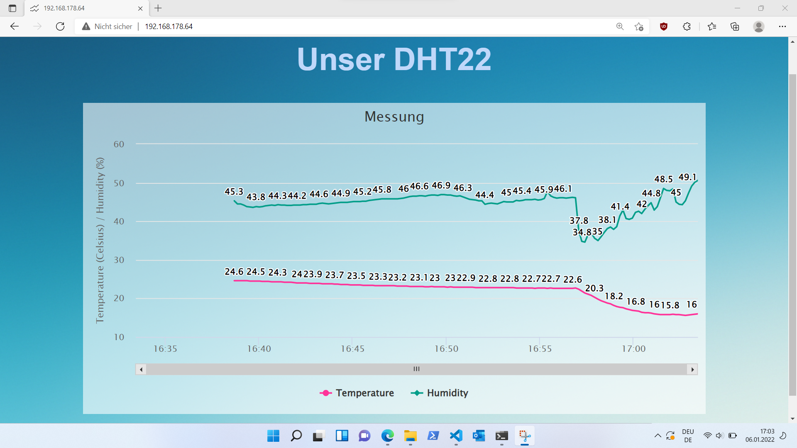

# TempHumiditySensor
I need a way to monitor temperature and humidity in different rooms of my home. So i build a portable, smart temperature and humidity sensor.
## Hardware
* DHT22 to measure temperature and humidity

* ESP8266-01 as computational Unit to read sensor values and host Webpage

* BatteryShield V3 to power the Device from an 18650 cell

* [3D Printed Housing](./cad)

## Software
Code can be found in [TempHumiditySensor.ino](./TempHumiditySensor.ino). I try to describe the basic functions here:
* For reading the Sensor Values we use the DHT Library
* We then write timestamp, temperature and humidity to a circular buffer
* The ESP-8266 Provides a simple Interface with given routes
    * /now
    * /timestamp_log
    * /temperature_log
    * /humidity_log 
* Each route is returning its value as a json
* We transfer the Website from [data/index.html](./data/index.html) to the Flash of the ESP8266. Instructions can be found here: https://randomnerdtutorials.com/install-esp8266-filesystem-uploader-arduino-ide/
* When the Website is refreshed we get the past values from the log-routes and continue by pulling the current values from the now-route.
* The Graph is drawn with the Highcharts JS API https://www.highcharts.com/demo

## Assembly
 

We see a drop in room temperature as I opened the Window.

